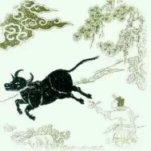

 
# 未牧
> 生狞头角恣咆哮，奔走溪山路转遥。

> 一片黑云横谷口，谁知步步犯佳苗。

第一句说的顺序也很有章法，不是乱说的，他先说生狞，先说了这个相貌比喻的心性不完整，由不完整而生出情绪多端，由情绪多端而生出猜疑防范，由恐惧猜疑防范而生出语言的攻击性。  
所有的争吵你们细琢磨都是这样。大到战争，小到拌嘴。像“止语”就是个法门，很多人发愿多久多久不吐一字一言，不表达是很大的一步，为的是灭掉自己的恐惧心，让自己的心能够真正打开。
第二句“奔走溪山路转遥”，由于第一句所描述的意的顽劣，我们要奔走，要远游，要追寻。 这是经历，就像西游记里头，孙悟空那般顽劣，那是童心，它一定要长大，再一点点把自己身上建立起的框架剥离回归。孙悟空问过一个菩萨，说菩萨你怎么一会儿说《心经》，一会儿说《多心经》？ 说的就是心本来处，生了个多心，生了个顽劣的“意”。

“一片黑云横谷口”，这时候天要下雨了，这头牛却还不回家，“谁知步步犯佳苗”。一片黑云可以指外在的逆境，我更偏好指内在的逆境，低落消沉瓶颈郁闷，活得很不开心了，这是内在的逆境。人人都有过内在的逆境，很多人内在出现了逆境，但还是“未牧”的状态，不知道这份心性可以自己驯服，也就是佛陀说的降伏其心，不知道有这回事。 那么内在的逆境即便出现了，也不知道回家的路。可在外面怎么办？步步犯佳苗。

“佳苗”指萌芽的希望，其实无论人的状态如何，希望永远存在，是看不看得见的问题。研习社里总说世界是你意识的投射，你的意识状态是糟糕的，投射到的内容也是糟糕的。所以这头牛会看不见佳苗，反而把希望都践踏掉了，“步步犯佳苗”很形象啊，很像一头看不见路的牛，这是他内心那片黑云障目，让他变得盲目。

这首诗我看到了作者的慈悲。那种面对众生的无可奈何。本来当下即可到达，但是你却越走越远（路转遥）。但是师傅能怎么办呢？你的头角，你的咆哮，大势在你这边啊。师傅只有承认自己错啦。等待。等待那片黑云变大，尽管心中无数个不愿意，但是没有办法。
想起曾经在这里聊过一个故事，关于韩愈和韩湘子的。韩愈写了一首诗，其中有两句：“云横秦岭家何在？雪拥蓝关马不前。”传说这两句是韩湘子几年前给他的，在那刻他知道了自己的浅薄，知道了自己“未牧”的状态。
要是片黑云还算好了。如果是白云呢？就更麻烦啦。有句诗说得好啊：“一片白云横谷口，几多归鸟尽迷巢。”一切都太好，太顺了，韩愈就是这样的，忘记了回家的路。都不愿意回家了。在禅师的眼里，黑云和白云没有分别。
