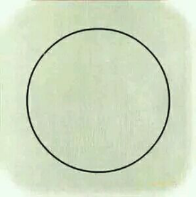

# 双泯

> 人牛不见杳无踪，明月光含万象空。

> 若问其中端的意，野花芳草自丛丛。

现在通讯太发达了，家书这个习惯没有了，以前有家书的时代，亲子之间的连接还是很紧密的。因为写在信上的话，你每句话都很珍重，不像打一个电话、发个短信。现在过生日发个短信：生日快乐，这生日快乐好没意思，感觉好像少了点什么，少了一点味道，你自己发出去的时候心里都知道，少了点什么。这个祝福给的好轻易的，这到底是不是祝福？还是我只是为了说而说？可以说现在的语言太随便了，以至于我们对于由语言做载体的知识、信息或者说智慧，我们看得就很轻易，轻而易举。
这个社会一定是语言越来越丰富、越来越复杂的，但这个趋势不是简约的趋势。你看电视剧的名字就能看出来，以前电视剧：《渴望》，好抽象的一个名字，话剧的名字：《家春秋》，一听这个名字就知道这本书很厚，太抽象。以前的电影：《飘》，一个字。但现在越来越复杂了，比如：三生三世十里桃花、微微一笑很倾城。包括歌曲的名字、歌曲的词也是越来越复杂，歌词都是长句，现在人很唠叨，这是现在语言发展的方向，不像以前，邓丽君的那首《独上西楼》：无言独上西楼，月如钩……就那么几句，场景一下就出现了。
语言上我们是走向了复杂、繁琐，误区越来越多，走上了这样一个时代。所以我们对于语言来传递、承载的东西就看得特别的简单。我所谓的简单不是正面意义的简单，这个简单是觉得很轻易。就像我想喝一口水的时候，就会有一口水让我喝；想睡觉的时候，就可以打个盹；想呼吸的时候，从来没有困扰过呼吸这个问题，就变成这样的轻而易举。因为信息太容易获得。
从这一点来看，就逐渐能够理解，为什么以前的禅宗大师不写古文，都是以诗为载体，去承载自己的思想。他不写文章，全都是诗句，有的诗句就一句话，有的诗句就四个字，用这些最简约的东西，去承载他所想传达的智慧。因为简约有力量。因为简约给别人留下了空间，让人去探索。你听很多禅宗的偈子，有些偈子听起来就没头没尾的，不知道在说什么。但这样的话有力量。
更有人就用图画来展现这种智慧。用图画来展现智慧其实很难的，因为画是一个最具象的东西，但它要传递的是不可说的智慧。
所以在十牛图上我们能看到他做了很多额外的东西，比如说牛的颜色、太阳的位置、到了后面天上星星的数量，那都是有寓意的。放在那里等懂的人去看，不懂的人看到了也没关系。
总不会像现在人一样，总是做这样的事情：我现在就在做这样的事情，没办法，不断地去卖弄。但这个卖弄背后，有些话为什么这么去说？有些事情为什么这么去做？有些道理为什么用这样的方法去讲？你们要多一个弯儿去想一想。参禅的那个参字你不能忘，那个“参”就在你们自己身上，我们教不了的。

有的时候做事情，你要是多一个弯儿去参一下，有可能就懂了。多那个弯就是你的自主性，你们自己主动的力量，那叫参。什么叫参？这叫参。你们有主动的那个力量，永远不会忘。到的都是别人给的一个良好感受。
好比现在孩子每天跑两大圈，我们跟在后面，跟着他跑两圈跑完，只要不停，拼了命的跑，跑完那个气是上不来的。孩子刚停下来，我们在后面一拍，说：“哎，你到了！”那一下，他可能真的觉得自己到了，那个感觉很像，但到没到？没到，那是个良好的感觉。那是别人给他的，没到，为什么？没有参。

虚老四十多岁的时候杯子碎了，这大家都知道，杯子碎了，哦，悟了。你们碎没碎过杯子啊？碎过吧？你们东西掉没掉过？掉过的。你们为什么没悟呢？你们没有参，你们没有那个反观。没有这个反观，别人告诉你，全是假的。就类似于刚才说，你跑步跑到气上不来了，跑到全世界一片空白了，缺氧了嘛，你看周围都白的，跟你说：你到了，那是一回事情，自己根本没到。
像释迦摩尼抬头望星空，哦，他悟了。大家都望过星空吧，那为什么你没悟呢？你缺的是这个参，只有这个东西。你不要想象说释迦摩尼有多大的神通，当时他抬头望星空怎么望怎么望的？你不要去想这个，这跟你没有关系。人家传递出来的故事就是很踏实的，他抬头望星空，和你们抬头望星空动作是一样的。他用神通的话就不不抬头了嘛，我要有神通我也不抬头，抬头干嘛？好累的。

所以说要有神通，我为什么要抬头看呢？好累的，肯定不抬头了。这个故事就告诉你们，释迦摩尼就是正正常常抬头望星空，他坐在那里打坐，抬头一看，哦，明白了。那大家都这么抬头看过对不对？你们最近肯定在这里晚上都出去看过月亮是不是？但没有明白呀，缺了参，缺了这个真正的主动的东西。到时候明白是谁明白呀？是你明白。是你明白，不是我明白，也不是他明白，是你明白了。你明白了你的参没有，你的参没有，你想通过某个意外的机缘巧合，想通过别人怎么点播你一句，想通过谁下凡怎么样怎么样…全都是外界的力量，那没明白。

你们永远要记住一点，学这个是明白你是谁，明白你的心是什么，去见得真正的你自己，去了解生命这个大问题，这是学的目的。这是究竟目的，你不了解生命问题，你只在理上面入，枉学一场。只理入，枉学一场，还不如把这个时间去陪孩子陪家人，理入是没用的。
我再强调一遍：理入没有任何用处。理入佛法跟钻研其他的学科没有任何分别。如果没有一份求证的精神的话，它就会失去分别。佛法和其他学科，我们拿最接近的哲学来比较，因为佛法在西方总会说成哲学。佛法跟哲学最大的区别就在于：佛法可以实证，而哲学是空谈。到了现今的哲学更加是空谈，很多东西已经没有办法实证了，只有在理论上对质，但是佛法每一步都有实证，都可以证得的。你在身上不证得、不去修，这辈子过去了，下辈子照样什么都记不住，重来。
你想想看，理入靠什么入的？靠头脑入的。但证靠什么证？证不是说身体证，说身体力行，那个意思是，你们真的自己去行动，那是非头脑的。你真的做到那里了，你想走，盘腿就走了，这叫厉害好不好。但这种厉害也未必是达到哦，你有这个盘腿就走的能力，也未必说你到了。

为什么要去了解我是谁？我究竟是谁？你总归不会是你这具身体吧，你们学到现在这一点总归是要明白了吧，这一点再不明白，真的是榆木脑袋啊。你不是自己这具身体，那你是谁呢？
为什么要了解这个问题？了解这个问题，让你真正脱离烦恼。有没有烦恼？有烦恼，但是很快能过。有没有情感？有情感，但你这个情感不会变成一种执着。作为凡人一定是烦恼的，没有办法把握这个度。内圣外王的人，区别就是烦恼的度，随时可以把握，那就真的掌握了自己的生命。烦恼有，但是恐惧不大有，你就具备了面对烦恼的能力。现在人没有办法面对烦恼，那是烦恼背后还有一个恐惧，恐惧摆在那里，肯定没有面对烦恼的能力，那是根本问题呀。
这就是佛法和其他道理完全能够区分清的地方。我们人的本性、佛心、心性或者自性，全都能够证实得到。全都能够亲自体验。不但体验，并且是验证，仅体验还不够。有的人体验变成玩了，搞歪掉了。什么叫验证？这个证是有一份心在那里，你的心定得住，不会这个东西被牵着就跑，这叫验证。这是根本。

像你们打坐，一天两座连打了21天，效果那是真的有啊，静了很多。那种呜呜的东西干净了很多，人亮了很多，烦恼杂陈少了很多。但你们要记住，这样的一个成果，你们回去以后一定退转。我不是打击你们，是要让你们明白，为什么退转？因为你没有加入自己主动的那个“参”。没有这个东西进去，到后面你们发不出心，也发不了愿，都做不了的，自然也得不了道。
你们为什么愿发不出去，心发不出去？你说为众生，一看普贤菩萨、药师菩萨、地藏菩萨，他们怎么发那么大的愿？你难以想象，因为你的心离他们太远，没办法和他们呼应。你想象不到他们这个位置，他们怎么出来的这个东西？
我们现在人好像觉得自己就这样就可以了，我到走之前，能有个好的解脱，有个好的结束，我下辈子再当个人，大不了我再种个念，下辈子再继续学佛。大多数人这么想想就可以了，你没有办法想象，他为什么能想到这一点上，他为什么能发出十大愿，他为什么能发出十二大愿？他们怎么来的这个心量？他们跟你一样是人，那你们的差距在哪里？其实说到底，差距就是这个“参”字。

我观察大家学习算是有点时间了，大家这个字做到的太少。有时候我们也在反思，是不是这个环境给大家创造的太理想了，因为你们知道21天这么多人，很难的。而且21天这么多人，大家都很配合，都有这个心力，真的想学好，真的想明白。我说你们没有参，并不是说你们不想明白，是你们还没有明白参是什么。
那“参”到底是什么？这没有办法完全具体地概括，但是可以跟大家描述一种感受，这感受就在今天十牛图的第十张图里。十牛图第十图画的就一个圆，没了，里外都是白色的一个圆。牛没了，人也没了，为什么能够达到这样的一个状态呢？前面图里有人、有牛、有草，还有太阳、树、水、庄稼，好多，还有星空，白云…到第十图这些全都没了，就剩下了一个圆。如何变成这样的？
你们可能想的是，这可能是打坐当中遇到的一个状态，或者这可能是修行当中忽然开悟的那一刻遇到的状态。大家应该都有这种这种猜想吧。有了这种猜想，你就永远在猜想当中，一辈子都在猜它，一辈子都靠近不了它。这个道理还不能了解吗？对不对？我永远在猜，它就永远离我是远的。我什么时候不猜了，不猜了它就不在了吗，还在呀，好，合一了。
就好像以前一个禅师是做官的，学了三十年一辈子了，一直没有成就，他自己也不知道该怎么办。到后面不学了，当时卸甲归田不学了，回去种田，用锄头刨土的时候，刨着刨着，忽然悟了。他不学了，他真的不学了吗？我就问你们他不学了禅就不在了吗？就好比你已经会了1+1=2，忽然有一天说不学了，不学了这东西就不在了嘛，还是在啊，它永远都在。我不修了，难道它就不在了吗？1+1=2还更具体一点，禅修是完全没办法概述的东西，你不修了，那你之前做的所有功夫全都可以归零吗？不可以呀，功夫放在那里了，你不修了它全都在。你们想想看，为什么不学了，他明白了？为什么不修了，反而明白了，这个道理在哪里？
很简单，执着心放下了。是我要追的那个心放下了，你要追的话永远在追，一辈子到不了。就这个道理，就好像你在治病，那个病就永远在，医院不会让你跑掉的，巴不得让你多呆几天，你的病永远在。你的关注点放在那里了，好，它就永远存在。
修也是一样，你要修，那你就一辈子修吧，你这个修永远在。你的关注点没有放在明白上，你的关注点放在修上了。21天时时刻刻谁想过：我得怎么样明白。这就叫参。你们想的是：我跟着流程去修，那你永远在修。
以前讲过：你不要去追求一个东西，你直接把自己定位到那上面去。这个实际上说的并不是特别准确，但能让你在道理上懂得。你把自己定位在那上面，你就是那个样子，这只能头脑上理解，并不是真懂，我们也知道，就是这个道理。

以前有个公案，一个居士老太太，已经大彻大悟了，她供养了一个僧人，供养了三年。三年之后，这老太太要试一下这个居士，就找她女儿去勾引这个居士，看他起不起心。
她女儿去了之后，这居士动都不动，眼睛都没有抬一下。他说了一句话，意思是：我的心已经是一口枯井，你这样没用的。他境界已经很高了，但老太太当时听她女儿讲了之后，好难过，捶胸顿足说：唉，我三年供养了一个痴汉而已！把这个居士撵出去了，一把火把供养他住的房子烧了。僧人和在家人是不能住在一栋屋里面的，是要分开的。
这问题在哪里？问题在于他还在用意念压，用自己的功力压着自己的欲念。这种人忽然有一天一动、一放开，那不得了的，就变成邪师了。
同样还有一个故事，大家都非常熟悉：拈花微笑，都知道吧。为什么拈花所有人都没笑，迦叶笑了？“吾有正法眼藏，涅槃妙心，即付嘱于汝。”为什么？这是最有名的公案，所有学佛的人都听过这个故事，但都不懂这个故事，大家好好去想一下。我们把这个话题先放这里停一下，说回来十牛图。

为什么所有东西都没了呢？牛没了，人也没了。第十图肯定不是说，打坐的时候到了某种状态，或者开悟的时候到了某种状态。如果说第十图就是这种状态，这话说出去真的没有意义，因为你不能说这话说错了，就像前面公案禅师被勾引，他说我的心已经是枯井了。你不能说这个禅师说错了，但他就是哪里不对。一样的，你们产生这种想法，你们难道没有怀疑吗？你们问问自己的心，难道没有怀疑吗？你们一定没有那种恍然大悟：啊，一定就是这样的！你们肯定没有这种确定。都是猜的，那是怀疑的，怀疑的就是错的呀，这还有什么讲的。
这是你的本心，如果你想对了，那还能怀疑吗？如果你理解对了，你还怀疑这个答案吗？你不会怀疑的，那是你呀。我不管你证没证到，一样的，你证没证到那都是你嘛。好像你多年失散一个儿子，你认不认得他，他都是你的儿子，就这个意思。那个你，你认不认得她，都是你，所以你不认得的时候她也是你，但你认得的时候你一定是无比笃定。
你们永远不要去猜，猜不是参，那是完全的两回事情。参，没参到就是没参到，不停的去试探这个结果。参到了，你心里面会：哦，忽然落地。有的叫小参，有的叫大参。小参是小的事情上明白了，但没有大彻大悟。在小参上明白、体验过的话，那个感觉你知道的，无比确定。大参也是一样的，参到了无比确定。
所以对于十牛图第十图，大家之前有过的猜想，都停下来吧，都是不对的，或者说都是妨碍你们前进道路的。那个一直在修的人，就永远在修下去；一直在追的人，就永远在追下去。这就是妨碍你的东西：你们的猜测。放下了，才有明白的机会。
你们要听明白，我没有说它不是打坐，不是开悟的状态，我没有这么说。但你要认为它只是这样，那你就错了，这话一定要听明白。为什么这么讲？我们刚才最开始说了，学禅修禅最终是要干嘛？是认识自己。这个自己是真正的自己，不变的。不然我认识她干嘛？好像认识我前世一样，有什么用吗？我前世还有前世，我这辈子也是以后的前世，我现在已经认识了，没有用的。
所以这个要记住：你们认识的自己是真正的自己，她永远不变、不生不灭，是恒定的，她无始劫以来就存在，这叫自己。这叫认识了自己，这是修禅定的目的。

既然这是你真正的自己，难道这个自己只有在你开悟的那一刻才在吗？只有在你打坐那一刻才在吗？你们知道不是，她一直在。
那反过来我再问你们，日常衣食住行她都在，那第十张图到底是什么意思呢？衣食住行啊，有衣有饭、有房有车，真正的自己都在，好，那第十张图什么意思？（现场一片安静…）你们现在在参了，知道吗？你们现在就是在参了，虽然你们参不到。为什么参不到？你们刚开始用。真正的自己都在，第十张图又是什么意思？
同样的虚老是听到一声响，明白了，他不是打坐的时候明白的。记录非常清楚，是听到杯子碎了：哦，明白了。之前打了三十、四十年的座，但听到杯子碎了，明白了。
哪里来的明白，怎么个明白法？你们之前都在想，我打坐的时候出现某种状态，打坐的时候什么都没有了…怎么怎么样，都是这样的思维。你想明白的是真正的自己，但真正的自己不是你打坐的时候才出现啊。打坐的时候才出现那是做梦，真正的自己是无时无刻都在。这也就解释了，为什么释迦摩尼打坐了七天，最后是看星空明白了，到你们不要误会我说打坐没有啊，人家还是打坐七天的，像虚老就算明白了，之后还是继续打坐的。
佛陀他为什么看星空明白了？
同样，维摩诘居士说法的时候，忽然天女散花，大阿罗汉身上都沾上了天女散的花，大菩萨身上不沾，花自然落下。为什么呢？你们要看过南老《维摩诘的花雨满天》的话，他当时给的解答是：因为第八阿赖耶识根器未断，大阿罗汉的根器未断，所以天花还沾得上，大菩萨根器断了，花不沾身自然落下。这是一种解释，是当时他给在座的人讲的。不光是这种解释。花自然垂落，为什么？
同样，奥修有一本书叫《没有水，没有月亮》，讲一个比丘尼的开悟过程。那个比丘尼一直没有悟到，没明白，她有一个任务，每天去山下湖里挑水回庙里，这是她的工作。有一天她在湖面舀满了一桶水，结果桶“咚”一下子散掉了，她一抬头看到了天上的月亮，这时，她说了一句：没有水，也没有月亮。她开悟了。
这个道理到底在哪里呢？既然真正的自己无时无刻都在，自然我也可以说，第十张图无时无刻都在，对不对？那是真正的自己嘛！无时无刻都在啊，现在在座的各位都坐在这里，是不是？那这个第十张图跟我现在的状态怎么挂得上钩呢？（现场一片寂静…）你们一定要把自己曾经学过的东西忘掉啊，什么大脑停止、什么切断杂念…一定要把曾经学过的这些东西忘掉。有了这些东西你们就是那个痴汉，它给你一个好的感觉，但是你们没有到。禅，就是非常诚实的一件事情。
你们可以表现的自己状态非常好。你表现成这样，我也配合一下，看破不说破。但没有到就是没有到，没有明白就是没有明白，被知见挡住了就是挡住了，这个知见要放下。

好，讲到这里我们再回过去，看第十图图诗是怎么写的：
《双泯》
人牛不见杳无踪，明月光含万象空；
若问其中端的意，野花芳草自丛丛。

前两句不用看了，前两句不用讲，你们都已经懂很多了。第三句开始：若问其中端的意，野花芳草自丛丛。这句话什么意思？

你们理入的都是前两句。但是我要告诉你们，理入没用，你们现在应该已经知道为什么没用了吧？你们看到第一句：人牛不见杳无踪，诶，这个道理我明白呀。研习社的课你们跟下来这么长时间，这句话肯定明白呀：空嘛，空性。都空了，还哪里会有，所以人没了，牛也没了，空了嘛。这就叫理入，懂吗？你们现在看看，第一句好像都明白对不对，但是有用吗？没用啊，这个明白没有用。这就是为什么我告诉你们必须去求证，就是这个道理。

第二句：明月光含万象空。明月什么意思？照嘛。万象，什么万象？眼耳鼻舌身意，色受想行时，贪嗔痴慢疑，这叫万象。明月光含万象空：照见五蕴皆空。全都空了，这句话也很易懂。这也是理入，这个理入就没有用的。我好像明白了，而且我的确明白了，但我明白了什么呢？还是什么都不明白。这就叫理入的空无，理入的虚无，懂了吗？

后面一句：若问其中端的意。大概这个禅师他也知道，你明白了这个，只理入没有用。要问这里面你究竟明白了什么意思呢？野花芳草自丛丛，但图里面没有野花，也没有芳草，为什么能跟这个图搭得上钩呢？解一下：搭得上钩是这个“自”，自在的自。野花芳草，怎么样自丛丛啊？人家很自在才能自丛丛是不是？不被干预、不被干扰才自在嘛。像这村里的草现在也不自在了，为什么不自在？因为撒除草剂就不自在了，就被干扰了，没有办法自丛丛。你往这片树林里面看，好久没有人打理了，好，这叫自丛丛，就很搭得上，为什么叫自丛丛？不是说乱，而是它没有人干扰。你去看你们小区的花坛是自丛丛吗？不是嘛，被干扰了。
好，不干预。我为什么不想解呢？不想解释也在于这个，因为我这个“不干预”说出来，好了，你们心里：这个“自”就是“不干预”，那又完了。但关键问题是，我没法说你错，但你就不对。就是这么个道理。
唯一能挂得上钩的是这个自，观自在的自。“观自在菩萨，照见五蕴皆空，度一切苦恶。”就这么个意思。
这个自你能不能理解？这个自最像哪个字？最像我字。“唯我独尊”，释迦摩尼为什么说：唯我独尊呢？（书茶友：因为这个世界是一元的。）你别说了。你这么说，我没法说你错，但不对啊！为什么不对呢？你自己也觉得自己说出去很苍白嘛，你说的是你会的东西，对不对？
反过来我们换一种模式也行的，就是：都对。你刚刚说的也对，刚才还有谁说的，都对。你们也就明白了：对不对是假的。你到底有没有这个答案？这个答案是假的。好比说那个真正的你，无时无刻都在，无时无刻，现在也在啊，但你为什么不认得她呢？她没有一分一秒离开过你，你为什么不认得她？那个终点是假的。你能说你这一分就是终点吗？明明没有啊，还有下一秒过来。下一秒是终点吗？也没有，你还有下下一秒过来。你生命结束就是终点吗？不是啊，生命结束还有来生呢。对不对？那个答案是假的。
你也不要想象说：那个体验才是真的。答案是假的，我只说了这一句。你千万不要在心里再补一句，再补一句，你又回到心里的那一句了，我刚才说的那一句又完了，所以叫“如是我闻”。

这个图我完全可以换一个方法解，解出来好像大家都听得懂，但没有任何意义。比如我说，图中的圆什么意思？圆代表圆满。那这圆满跟你有关系没有？你圆满了没有？你懂我意思了吗？圆还可以代表我，原点嘛，也可以这么解释。但是你觉得这一刻你是这个圆吗？你也没有觉得你是这个圆，这答案也没有意义。
我说圆内外都白，证明习性全无，这叫照见五蕴皆空。蕴就是习性，藏在里面的东西就是蕴，蕴藏蕴藏，蕴就是藏，不展现在外面的，藏在里面的。照见五蕴皆空，习性都没了，都漂白了，都变成白色的了，内外都白，之前的黑牛变成白牛，到最后牛都没了，都放下啦。我这么讲你们都听得懂吧，但有用吗？你们真懂了吗？

好比当初我还蛮小，莲花微笑的故事谁都知道，我琢磨这个故事经历了很久很久，呀，我明白了，然后跑去跟父亲说。那一刻我记得非常清楚，我父亲跟我说，你说的这些是佛教界公认的一个道理，是大家公认的。我说是公认的，但是我没办法认啊，之前我没懂，我认什么呀？我没办法认，我认什么呢，对不对？一个故事听过来我懂了吗？我没懂我认什么呢？所以一个答案是假的，答案永远是假的。即使这个答案再对，它都是假的，它没有办法变成你。就像这幅图，现在它没有办法变成我。但不去否定它，不是说它没办法变成我，我就不去管它，就不再去追求了。你说我有没有追求，我当然追求了，想了那么久，拈花微笑就这么一个故事，好多年没放下，总没事儿就想它到底是什么意思。我也听了好多各种人的解答，它到底是什么意思？没听懂就是没听懂，没懂我就没办法认。什么叫懂了？懂了就是懂了，懂了就是那一刻我是它。

所以一个圆放在这里，说圆满是最简单的了，但这个圆满你不是它，你不是它你不能认的。虽然你知道，这是一个终点，但怎么走过去，是不能放弃的，所以也是执着。但此执着，非彼执着。

刚才说到，野花芳草自丛丛。“野花芳草”是什么意思？野花芳草还没解，野花芳草是什么意思？其实我问你什么意思，也是在犯你们的戒，本来我就说不要给答案，现在又提问，在逼着你们犯戒。所以老师是你们的魔啊，不能说老师了，坐在这里的人就永远是你们的魔。坐在这里的人就是你们的魔，哪天你们坐上来了，你们也是大魔头，逼着下面的人犯戒，没有办法。什么答案其实都不对，野花芳草稍微讲一下就是哪哪都是，不稀奇的，不古怪的，最平凡的，最平庸的，哪里都见得到的。你见到它不会觉得眼睛一亮，是会忽略它的东西，就是野花芳草。
我们永远在忽略我们的生活、我们永远在忽略我们的一举一动、我们的思想、我们的起心动念，永远是忽略的，这就叫野花芳草。呼吸，永远在忽略它；你的动作，你也是忽略的；身体的感受你是忽略的；你发脾气你都是忽略的，你都不知道，发完了，“哎呀，我刚才真是”。这就叫野花芳草。换句话说，野花芳草意思就是无时无刻的东西、无时无刻的过程。“自丛丛”，在无时无刻当中，真正的你都在叫“自丛丛”。你都在。

所以最开始我问你们有没有问题，其实没有问题是我想到的，我想到你们肯定没有问题，为什么没有问题？因为你们没有参。没有参的话产生不了问题，因为这一切带来的体验都很好。或者说21天每天晚上都有课程，这些课程好像都能给你们一个答案，太现成了，以至于忘了参，所以没有问题。但你们实际上哪里都是问题，你们任何所学所得，都经不起推敲。我可以说在座所有人站起来，讲你们打坐的时候的过程，你们到底在做什么？都经不起推敲，并且你们找不到方向，但你们却没有问题。
你们没有意识到自己问题的严重性吗？这是最严重的问题，想过没有？没有这样的参与，没有自己主动的参与，这些经历只能变成美梦一场。但是你们记得住自己几个美梦？此生此世的哪个美梦记得住？这是美梦一场。但是加入了自己的参、参照、或觉察，这就不是做梦了。这就真正变成了实践，你所下的每一个功夫，都会积累在那里，不是虚幻的，是实际的。所有的功夫都放在那里。不然是如梦幻泡影。
你们现在下的这些打坐的功夫，只要一个月你们不坐，立刻回去，之前一点点都不剩，你们再打坐的话从头再来。为什么？因为之前只是在那里坐，打坐真的变成了坐，变成了打两条腿。那就真的是积累两条腿，这的确一分耕耘一份收获一份所得，就不要妄心说我在打坐也有这样的积累，没有积累。因为你当时打坐真实在坐的就是两条腿，所以一个月之后你两条腿还是有功夫的，但是智慧上没有任何功夫可言，积累不住。

为什么积累不住？你根本就没有积累呀。做一个好的体验不行的，所以大家千万不要浪费这种机会，平时你们集体在一起静心的时候，这种机会非常宝贵。像课前集体静心时间非常宝贵，我刚才走过来的时候，感觉你们的状态非常好。很静，比以前静很多，坐得下来，那个心放得下来。不够啊，放得下来，这么好的一个环境，用啊，有时候下功夫最好了，很难得。你们在一起打坐这样的打坐，比你们自己在家独自打坐，那真的不知道要轻松多少。所有的机会都不要错过，包括你们独处的时候。所有的机会都不要错过，什么时候你也能摔出来一个开悟，那你就赢了。就这个道理。

再说一下这个也是比较重要的，怎么叫看星星悟道，听声响悟道？怎么叫这个呢？我现在说白了给你们听，等于是泄露天机，所以你们要珍惜，我反正也无所谓了。哪里听能悟道？听，本来是一响，对不对？诶，这一响哪里来的悟？一个事情发生在眼前，砰，一出现，或者我一抬头看到天上有星空，或者这里有灯光，或者我面前有这么多人，忽然我悟了，那不是一样的吗？我看一群人和我看星空有分别吗？没有分别呀，重点都在我看，是不是？因为我悟道嘛，重点在我看啊，看什么没有分别，那这个看悟在哪里？这个看跟第十张图又完全相应在哪里？去体会一下，“看”，你的精神有个反转，你看出去，你的意识有一个反转，回一下头。回一下头，平时都是看出去，看出去，看，就看了，没有这个回头。
谁在看？我的眼在看吗？谁在看？听，谁在听？有个反转，这就是谁在听，这个谁的用意嘛，念佛谁在念？这就是谁的意思，为什么要说个谁在念？参禅的人是神经病吗？念了还在问谁在念，为什么有个谁？谁就是让你回头。
这个问题好简单的，念一句阿弥陀佛，你问个两岁的孩子谁在念，都知道我在念啊，很简单的问题谁都可以答的，玄机也就不在这里了。为什么说要妙一点、玄一点，妙一点玄一点就是给你个空间，要你回头啊，不然你不回头的。不然我们人就跟那头牛一样，不懂得回头的，你不给他一个空间，它不懂得回头，谁？诶，谁？回头。  
一念一收，这么一个反转，自己去体会。这只能说到这里了，再多说下去，你们就要错过了，我就要话多了，就不对了。

这是第十图想传递的信息，就在这里了。第十图懂了，前九张图都是多余的话。有个前提啊，是第十图懂了，那前九张才是多余的话。这不是自大，你们去想一想，哪里来的多余。这是十牛图最后一讲，讲完了。
你们现在都是唱歌结束的，对不对？你们是不是已经习惯这种结束方式了？说到这个，真的想到弘一法师的《送别》。《送别》的词也是大彻大悟之词：

> 长亭外，古道边，芳草碧连天。晚风拂柳笛声残，夕阳山外山。

> 天之涯，地之角，知交半零落。人生难得是欢聚，惟有别离多。

> 长亭外，古道边，芳草碧连天。问君此去几时还，来时莫徘徊。

> 天之涯，地之角，知交半零落。一壶浊酒尽余欢，今宵别梦寒。

这个词就是野花芳草自丛丛。大家去体会，野花芳草自丛丛，还不够的，一定要前面那句：若问其中端的意，野花芳草自丛丛。他这首《送别》就是这两句话。再结合这第十图，结合今天所讲的几个公案，然后再结合你们平时打坐、行禅、做功课，再去想想。很不同的，就立刻看出自己打坐的差距了。打坐要明明白白地打，你们是无明地打，打打就无明，坐坐就无明。问都问不出来，那不是糊涂吗？
解十牛图，持续了两年，今天在社区完结了，一切的安排是最完美的。
