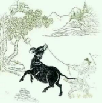

# 初调

> 我有芒绳蓦鼻穿，一回奔竞痛加鞭。

> 从来劣性难调制，犹得山童尽力牵。

禅宗的诗句我很喜欢，他们跟老庄佛陀的腔调很相似，更有一种猜谜的味道，这个我最喜欢。禅诗基本都有这种气质，让你想去一探究竟。
先说回牧牛十图，第二颂《初调》。“我有芒绳蓦鼻穿，一回奔竞痛加鞭。从来劣性难调制，犹得山童尽力牵。”第二首字面上很好理解，我有一根芒草拧的绳子，用它穿过牛的鼻子，只要牛一飞奔就痛使鞭子，这牛的性情天生顽劣难以调制，亏得有山童尽力牵制它。
我们有第一首的了解，再来看第二首就很好懂了。牛是顽劣的念头，我们的心念在脑海中飞来飞去从来不知道有牵制它这一回事的，一个心念一起是从来都不知回头的，这个回头可不是换一个方向，好比我如此一来行不通那么换个方法去行事，那是换一个方向继续起念。
这个回头是指一个心念被“看到”。最开始的“初调”还做不到“看”心念，心念太快了，诗句里用“奔”来比作他的快，这么快你还没法看，你只能让他停下来，怎么停呢？这里他道出了一个法门。
这里说“我有芒绳蓦鼻穿，一回奔竞痛加鞭。”牛的鼻子是最敏感的地方，一头牛很难驯服，只抽鞭子是没用的，但在鼻子这里穿一个环一拉就管用。一是说想要驯服这头倔牛，想要降服妄心，要懂得方法，不能硬来，懂了方法这是件简单的事。二是说了这个方法要用在鼻子上。其实就是我们的出息入息，这是观呼吸法门。

而“一回奔竞痛加鞭”，讲的不是物理上的了，是意识上的。你的意念一开始飞奔了，就给这飞奔的意念抽一鞭子，让它断开，其实是非常形象的。这个前后顺序也安排的非常好，观呼吸在前，断意念在后。回味一下，自己飞奔的念头一被觉知断开，跟这个念头被抽了一鞭子一样的，一下子醒了。而牵制劣牛的山童，这个山童就指我们人人都有的无法被沾染的觉知、关照。

禅诗的魅力就在此，语言很朴实，但细究一看发现非常切实生动，读不懂就像一个谜，读懂了立刻在你眼前活过来。不但如此，它会调动你生命的某些部分，让那些“有序的”忽然鲜活起来。
禅诗和其它的中国古诗还是有所分别的，她有一种自然美。如果你不了解她的意思，你只会觉得朴实，但只是朴实而已。一旦你知道她蕴含的所在，这首诗立马变得无比的美，即使没有一句押韵或华美的词语。
