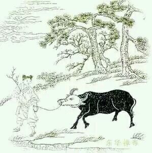

# 受制

> 渐调渐伏息奔驰，渡水穿云步步随。

> 手把芒绳无少缓，牧童终日自忘疲。

这首诗表明的是心念归顺的初始现象，“渐调渐伏息奔驰”，是说你一直观自己的呼吸，你的气息慢慢就被调理顺畅了，气息就在身体系统里奔驰运行了，这个说的是“身”。

后一句“渡水穿云步步随”说的是“意”，你的意识上天入地，一会儿想我要写教案，一会儿想我要把哪个学生批评一顿，这是说意识上天入地，即使这样，你那个纯真的关照也能步步紧随了。
不过这个阶段还是要“手把芒绳”，不能松懈，因为时时觉知自己的意识还不习惯，一松懈又回去了，所以这时候还要“无少缓”，但虽然一直无少缓，却也没有了疲惫，因为你的胡思乱想已经受制了，最累的时候是给意念抽鞭子的时候，那个阶段已经过去了。

这时候你们看那幅图，这个牛的头变成白色了，但还只有头是白的，身上都是黑的。 这里白色代表自净其意的“净”，代表不沾染、清净，代表纯真。 黑色代表以前的习性，积累的坏习惯等等。
