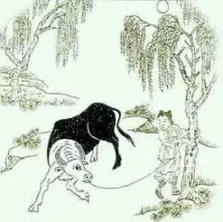

# 回首

> 日久功深始转头，颠狂心力渐调柔。

> 山童未肯全相许，犹把芒绳且蘩留。

到了第四颂《回首》，这头牛已经三分之一是白色的了。
在禅诗里面，回首是个很重要的词，有些诗里回首代表转身即是，有翻转的意思。这首的回首是说能够逐渐客观的看到自己的心念了，觉察和心念不再是紧紧相随了，他们逐渐产生了距离，这个距离能够逐渐做到客观看自己的起心了。
我们人美化自己的能力第一名，自己面对自己的时候也是美化过的，这样的美化有时会让自己开心，有时却也纵容了自己部分行为。这样获得的开心一定会瞬间转化成愤怒和不满。但是客观看了却不会，你是平静的，内心柔和安宁的去修正自己的言行，所以后面这句紧跟着就是“颠狂心力渐调柔”，这时候的柔和是真柔和下来了，这是向内的，不是表现给别人看的柔和。
到了这个阶段人基本能够看到自己的不足之处了，虽然看到，还需要真的花心力去改，所以这时候山童还不能全放手，心里这份纯真的警醒还不能离开，还要悬着这份谨慎。这就是这句“山童未肯全相许，犹把芒绳且蘩留。” 这个时候没办法，这头牛这时还不能自如，还没得自在，什么是自在自如呢，绝不是随便我干什么都行，那是纵容，那不是自在。

有一句话说得很好，这句话出自《小雅》：“人知其一，莫知其他。战战兢兢，如临深渊，如履薄冰。”很多人把这个译成一首议政的诗，我是另一个看法。其实这首小雅放在禅诗里也讲得通。
这句意思说，当一个人只知道一个现象的时候，就好比这头牛，他回头还只能看到自己的一个心念，他是知其一，那一定要战战兢兢如履薄冰。 这头牛的缰绳还不能放，他要战战兢兢。
