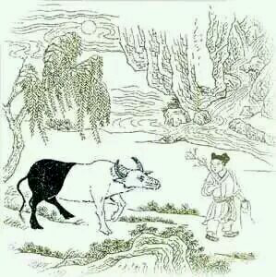

# 驯伏

> 绿杨阴下古溪边，放去收来得自然。

> 日暮碧云芳草地，牧童归去不须牵。

十牛颂第五首《驯伏》 ，这时候牛的身体已经三分之二是白色了。
这里说人的“意”已经开始自然了，自然是什么呢？自然是随顺，顺其自然。自我感觉已经化成无我随顺了，你看诗上说绿杨阴下古溪边，放去收来得自然。什么叫绿杨阴下古溪边，就是随便哪里都行，杨树是随便长的，生命力很旺盛，有点条件就长出来，这里说的就是随便哪儿，都可以随顺了。
后面说“日暮碧云芳草地，牧童归去不须牵。”描述的就是一个悠然自得的景象，日暮碧云芳草地，一个整体的场景，安静惬意，说这时候的阶段已经能够悠然自得了，山童不需要牵着牛了。
我们做事的时候，经常有这种情况，战战兢兢过头了，不够随顺，你本可以顺其自然的去做事，却偏要前怕狼后怕虎，什么都成不了，所以做事情要讲究分寸，要合时宜。你看这头牛是个黑牛的时候，就得牵着，这时候它还没有顺其自然的能力，你看这头牛白色居多了就不用牵了，再牵反而执着。
