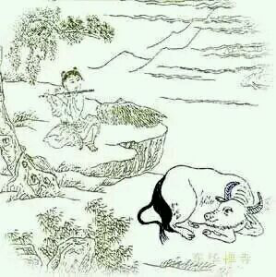

# 无碍

> 露地安眠意自如，不劳鞭策永无拘。

> 山童稳坐青松下，一曲升平乐有余。

现在这头牛可以在旷野里随意自如的休息睡觉了，不再需劳烦山童鞭策，可以一直这样无拘无束了。那个山童呢，他稳稳坐在青松树下，吹奏一曲，太平祥乐。
这时候这头牛，指飘忽不定的思维终于听话了，这里的“露地”指的旷野，旷野说的是你们日常思维的自由度、广阔程度，你们再回头看一看，之前的几诵里出现的地理场景，“步步犯佳苗”在第一颂当中自己的思维连最眼前的都顾不到，到了第五颂“日暮碧云芳草地”，远了，视角一下广阔了，但还有日暮碧云，还有芳草地，还有些障碍。
到了现在，到了无碍之时，就变成露地旷野了，没障碍了，你的思维终于知道停下来了，你的思维也终于开阔自由了，他们看似矛盾，其实是最不矛盾的，这个只有去实修才能够切实体会。
但绝不是否定日暮碧云，不是。日暮碧云是美的，芳草地是惬意的，任何美的、好的都不要去否定，“露地”绝没有否定她们，他认可所有美的、好的，正如他认可所有丑的、坏的一样。这就是无碍境界。
“安眠意自如”说的更露骨了，你的思维安稳的徐徐睡去，你的意就自如自在了。 这个睡去不是不管了，是他缓慢了，只要这头牛还在，头脑的意识就还在。谈到思维就不得不谈读书学习，之前给研习社的人也一直在说，书要越读越薄，那才叫学到了，学到后面学什么都游刃有余。读书读到最后变成积累知识，人容易学傻掉。世界就是这么游戏的，你执着什么最终被什么所累，执着知识到最后掉进知识里了，变成背书匠，人的趣味也失去了。

“山童稳坐青松下”，山童就是我们的识、认识。他落在哪里就认识什么，他也可以反过来变成觉知，变成驯服牛的人。这时候的山童稳稳当当的坐在青松树下面了。
为什么这时候不是白杨树而是青松树呢，白杨树之前说了，是任何地方的意思，这个来衬觉知不像，觉知可以“遍一切处”，但不是“任何地方“，这两个词语有本质的差别。青松是什么意思，四季常青，是永恒的意思，也就是不动，山童这时已经可以稳稳不动了。而青松又完美衔接了下一句，“一曲升平乐有余”。这个青松其实还通“轻松”，说得多好啊，立刻告诉你稳稳不动不是僵在那儿坐着不动，是这颗心轻松自如的不动。你一定是轻松的，才能够吹曲子。所以这首诗非常的妙。

这首诗写的非常完整，再返回去看也一样通顺，第一句讲的就是人在思维层面获得了自由，空间广阔，最后一句呼应了创造的快乐，乐有余。
