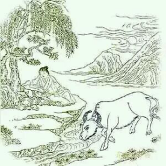

# 任运

> 柳岸春波夕照中，淡烟芳草绿茸茸。

> 饥餐渴饮随时过，石上山童睡正浓。

第七颂的意思非常好阐明，是说夕阳西下河水旁柳岸边，芳草地绿意融融的。这是描述了一个修行时到达的境界。 夕阳西下指人的一切意念、脾气、习惯，那些毛躁的东西都沉淀下来了。在现实生活中也这样，到了夕阳倾斜的时候，人最爱打盹，生物钟走到这儿会有一个安宁沉静的过程。
溪水柳岸也给人柔软柔顺的印象，淡烟芳草绿茸茸的视角感更是朦胧的，一片新绿又有淡烟萦绕，这个画面一想象就觉得舒服。这是说在外在环境氛围上，人的意识已经不起分辨了。这个不分辨是心里上的，心上的一切二元对立已经开始淡然了，不再在心上起分别之争。这时候的人见环境已经是这样了。

再看牧童（内在），牧童这时候已经睡着了，牧童一直代表的是人的意识，这时候自身的意识也睡过去了，不起分辨了。牛（思维）在这个阶段身体已经全部变成白色的了，你们看图，连尾巴都是白的了， 全白代表牛（思维）的一切恶习已经没有了。
这是说，当修到你的思维只剩善念的时候，意识睡着了，思维也能安然自如，任其运行，这就是题目《任运》，不用管也没事儿了。
刚才讲到说这是人的一种境界，就是大自在境。 进退无碍了。要说做事情，做事情人就要有这个境界，尤其当老板面对员工，团队领头人面对队员的时候，这个境界很必要。
这样的不加分辨是纯粹心相上的，现实中一切分别都在，但是在你心中已经没有了。 有人担忧说做事情没有分别心怎么行，反而陷入一个思维上的误区。这个思维误区很简单，当你担忧觉得做事情没有分别不行的时候，这份担忧本来就是一个分别。 也就是说，除非你什么都不前思后想，只有踏下心去做，才会体验什么是无分别。然当你无分别，你不是不会明辨是非，反而心中更多了数份清明，这样的清楚明了是以心相照，不再是头脑中的思辨是非。
一切莫名烦恼，都因头脑是非而起，事情陷入头脑之争，人必然烦恼。心中没有这些相是什么呢？你不再认为这个人是懒的、那个人是笨的、你认为他懒，他就只能在你心里展现懒的那一面，然而他还有人缘好的一面，你没注意过，所有焦点都在懒上了。当你心里的相没有了，看他就全面了，会更好的运用他的优点，让他得到更大的发挥。 这样的老板烦恼肯定少了很多。
这跟妈妈看孩子其实是一样的。现在大多数的妈妈，都不敢在自己孩子身上说出“任运”两个字。

刚岔开了话题，再说回这首诗，后两句。这张图就能看清牛尾巴也是白色的，在前面几张牛身上的颜色一直有变化。后两句说了一半，山童代表的意识睡着了，还有一半。
“饥餐渴饮随时过”。当人心中分别消失的时候什么表现呢：饿了吃饭（饥餐），渴了喝水（渴饮），心中不留（随时过）。随时过也就是时时当下啦！ 人要能活得时时当下，做事的时候也能时时当下，那离道已经不远了。这时候成了吗？还没有。还有妄念，这头牛还在，那就是妄念。不过已经是大自在了。
研习社的人刚结束了21天的辟谷，40多人的一次集体辟谷，成效不错。 有的人还想继续，还觉得不过瘾，其实没必要继续了，该放下的时候就放下，该干嘛的时候就干嘛，这个就是随时过。人往前走，心中不留。

书茶友：这头牛还在，那就是妄念，请问牛就是妄念吗？前面说牛就是思维，也就是说思维就是妄念？

沅汐：是的，妄是好坏都含，我们总觉得妄是坏的，其实也是好的。

书茶友：嗯，可以理解，但用妄还是容易引起歧义的，毕竟好坏都是一念。

沅汐：所以中国文化迎来了正本清源的时代。我们对很多词汇的理解都是有歧义的。在修行的过程中，这些念的存在都称为“妄”。一个词得看放在哪里用，放在生活中，就是善念、恶念、好坏都存在了。
这首《任运》用来说妈妈对孩子也衬得很。
现在大多数的妈妈在教育孩子和自己的生活上很难找到平衡点，基本都是失衡的。很多家长最大的问题就是生了一个孩子，全家把这个孩子当成了生活重心，尤其是妈妈。大多数的妈妈对孩子没有“任运”这个本事。生个孩子那简直就是第二十五孝。所有时间、精力基本奉献给孩子，自己的生活全部以孩子为主，工作瞬间变成了收入来源养家手段。 恨不得把一切孩子的不开心都分担了，把一切会浪费学习时间的事情都帮孩子屏蔽了，更多家长以学习更努力认真为前提给孩子分配娱乐时间：可以看两个小时电视，但是一会儿你得多做套卷子。
关键这样儿子就能变成你心目中的儿子吗？他只是被你管束起来的儿子，心里不乐意着呢。女儿能变成你心目中的女儿吗？也只是被你约束起来的女儿，不开心只是不强烈抗议罢了。所以很多父母感慨啊，孩子一到青春期怎么那么叛逆，变得也太快了，人家没变，心里一直是这样，只是小的时候愿意配合你，大了不愿意继续配合罢了。
最终孩子的路该怎么走还是怎么走，有些父母格局大些，影响的孩子格局也大些。有的父母格局小，把孩子本来无限的可能性也给管小了。 不管大小，人生的路照常进行，不是父母能够管得来的。可是父母因为常年以孩子为重心，生活状态已经改变了。尤其是母亲。
妈妈的自在与否在一个家庭中至关重要，夫妻关系、孩子教育、婆媳关系都集合在妈妈这个角色身上。很多中国的妈妈活不出自己的人生，活的是一个家庭的样子，我走在路上很喜欢观望领着孩子的妈妈的背影，真是一个背影一个家庭。但是自己的气息却很少。这个少不是无我，是自己根本没活出来。妈妈想要活出来，最核心的关键在于你对你的孩子，你能不能“任运”，在这上面功夫做出来，女人已经能够绽放了。

书茶友：怎么能活出来呢？

沅汐：怎么活出来，其实深入任何一个切入口，把它做透都能活出来。比如说今天讲的任运，你任孩子自由发展，只负责供他吃喝上学，把监护人应该做的都做到了，其他都尊重孩子的意见，是尊重，那是他自己的人生，你不做干预，这就叫任运。 这是任运带来的结果，绝大多数妈妈做不到这一点，绝大多数的父母不加以控制心里就痒痒。能够做到任运的父母，很不容易，需要时时提醒自己才行。
一个母亲乃至一个女性做自己的时候，她不再会把条件强加于任何人身上，丈夫、儿女、父母……自己做够就行了。她不再会去操心丈夫升职加薪，挂心孩子文聘工作，她会接受一切的可能性，并用庆祝的心态去面对。 她会把自己的人生活成一场精彩，而不是活成一场比较。

这个世界上，光不仅在烛上，能绽放的不只有花朵。
