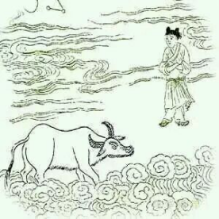

# 相忘

> 白牛常在白云中，人自无心牛亦同。

> 月透白云云影白，白云明月任西东。

第八颂第一句：白牛常在白云中。白牛代表清净的念、想、思，都很清静了。白云是清静的念想投射了清静的世界（白云）。在打坐上呢，这牛已经不是凡间的牛了，已经不平凡了，在这幅图中已经踏在云端升天了。这是说没了妄念，没了呼吸、没了身体、也没有空。到了一个很清静清明的境界中。在天上，是说一切凡间的相已经都没了。
日常中呢，妄念、呼吸、身体，也都没有，但这不是你们幻想的没有，一幻想就想成神仙了，不要幻想。这种话你们一幻想，就会问，那你平时是不是不呼吸呀？你这身体是不是变出来的呀？你是不是平常没有念呀？能这么问这么想的，都是幻想出来的。非但不自己好好下功夫，偏要去抓个神仙过来，这样的人赶快停下来。明确的告诉你们，都有，却没有。不但自己这样无端猜想，还要到处宣传，某某师怎样怎样，多么多么厉害，有什么什么通，造孽哦，快停下来。

这首诗第二句说的就很明白了：人自无心牛亦同。为什么无妄念、无呼吸、无身体呢？ 人自无心。  无心照万相皆无，有心照万相皆有。 这里无心了。

月透白云云影白。月主阴晴圆缺，无常的意思。这人间的无常透过清静的世界，展现的形态（云影）都是清静的了，无常也清静。人到这个境界就是大光明境界了。 打坐上也有大光明境界，人世间也有大光明境界，都到了。

白云明月任西东。这世间无常任他怎样，心都光明了，坦荡了，都可以了。
这首诗题为《相忘》，人到了相忘境就这么个状态。
可是人生何处不相忘呢？一场遗忘中度过的人生是数不尽的快乐。回头去看自己的十年前，多大的痛苦，你所能回忆的都是美好。很奇怪，相忘和美好就是绑在一起的。很多人说没有啊，十年前的某某事某某人，我现在想想还恨恨的。那是你没忘。

书茶友：相濡以沫不如相忘于江湖，是这个忘。遗忘中，记得对方的好。

沅汐：遗忘必然记得。 但已经不能用“记”了，过去的一段时光跟一餐饭的质量不同，你不会记得每一刻，但那段时光已经和你融为一体。有时候回忆起来，那段日子干了什么来着？忘了。忘了却能够回味生活的善意。如果干了什么能够如数家珍，嘴上说好不作数，心里总归是放不下。
只有在“白云明月任西东”的情况下，你去看相忘，那是喜乐自在光明。 在心中还是无数框架隔阂的情况下，去看相忘只有透露悲伤。
放在时间上来说，你痛苦的时候，去想这个痛苦早晚一天我会忘掉，让我痛苦的人早晚一天也会忘掉我，想到这儿又要多一份伤感。但过了几年，你没事儿了，再去想已经相忘的人和事，你会觉得非常轻松，反而心里会生出感恩。
然而时间是个假象。在这首诗里就说了这是个假象，一句“月透白云云影白”就说明白了。一切由时间组建的无常变幻，都是白影。不再有“让时间抚平一切”这一说了。到了这个相忘境，时间的幻相也突破了。或者说到了相忘境，时间也变成一幻了。一相忘，一切都回归给原谅、欣喜、感恩、宁静。 一切相忘都是爱的化身，就像一切结束都在酝酿新的开始一样。

忘而未尝忘，是相忘。
