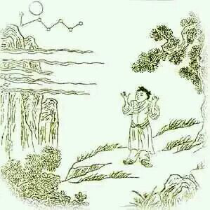

# 独照

> 牛儿无处牧童闲，一片孤云碧嶂间。

> 拍手高歌明月下，归来犹有一重关。

这个群是快乐群（此颂为无境书茶快乐群群聊整理），快乐到底是什么，谁能说得清楚？
有人说快乐就是没有痛苦，有人又要说快乐要对比痛苦，没有苦就没有乐，无论怎样讨论，快乐这个事情总是人们去追寻的。有人说我没追求快乐，我要追求的是了悟，那么了悟这件事情还是能够让这个人快乐的。探讨快乐永远是个话题。今天我们就从快乐讲起。

禅宗十牛图第九颂《独照》， 跳脱二元了，在《相忘》境界的时候还在二元中，《独照》则是刚刚开始跳脱二元了。刚才我们说快乐是二元对比出来的，那跳脱了二元还是快乐吗？
人们日常大多数的快乐是跟痛苦相伴的，即使如此也默默承受了，这一刻开心，下一刻烦恼，不断轮回着。 从没有想过另一种可能，可是我们一开始讨论另一种可能，就又要开始否定快乐了，真的是如此吗？ 如果讨论另一种可能——超越二元的可能， 却要因此否定快乐的话， 那么可以肯定的说，此人还在二元当中沉浮着，玩儿的只是头脑游戏而已。

这首《独照》说得就非常明白了，“牛儿无处牧童闲”，代表思维善恶的牛已经没了，之前是一头白牛，现在连白牛（善念）也没了，可是这个善念没有不代表诸位不去行为善意哦，这要分清楚。这头牛没了，是脑子主动思维的作用已经很弱了，像现在西方人测了一种阿尔法波，就是这个了，在静坐时如果静到深层次，就是这个状态，只剩下一个牧童，也就是意识，清清明明的在那里（牧童闲）。
日常生活中会不会有这种情况呢？会有。意识清楚在那儿，但是奔跑的牛不见了，这种感觉是很喜乐的，意识回归本位，不用再去管着思维，辨别真假是非，这是一种很清明松弛的状态。 我们之前说至乐无乐，这个状态就快到达至乐无乐了，还没有完全到达，但也已经很轻松喜乐了。
但是这里说了，不去管着思维，那么思维消失了吗？灭了吗？没有。就像这幅图当中，牛不见了，你不知道他去哪儿了，但你不能说牛不存在了。 这是很大区别哦。有很多人抓住这个开始灭念灭思维，这是很蠢的。
很多人在生活中会犯相同的错误，明明你去看生活中的生机处就行了，但是你偏偏要去消灭问题，结果问题越来越多，烦恼越来越重。 你要做的只是凝视生机，把所有生命中的希望和生机发挥出来，问题自然就消失了。但是问题不存在了吗？不会的，问题永远存在，但是已经没关系了。跟这句诗说的一个道理，思维不存在了吗？不会的，思维永远存在，但是已经没关系了。

那么到了这个喜乐状态，意识清楚的在那儿，就是“一片孤云碧嶂间”的状态，一片孤云是说自己，碧嶂间是说已经跳脱碧嶂了，已经脱离出来了，这里是自己明白了。

“拍手高歌明月下”是说意识非常的轻松，终于不再被牛（念头）牵扰了，明月下指清楚明白的照见。整句描述的就是意识清楚明了的“照见”状态，但是仍然是“独照”，不行啊，还有一片孤云，还有拍手高歌，还有碧嶂，还有明月下，还没到。虽说是自己明白了，但仍然没到。所以就有最后一句“归来犹有一重关”， 还有一关要走。
人到了这个状态是一个出世状态，什么都抽身在外的，不能融入，那是出世态。这样的出世态能入世吗？很难。这样的人不懂的怎样入世，无论什么样的集体活动他都是一片孤云飘在那儿，这不行的。 这片孤云说重了是我执，说轻了是还要再进一步。一定要把自己弄明白了。尤其是导师的角色，我又要批评人了，自己没明白之前千万不要出来讲这些。
做人做事切记贪图舒服，有很多人卡在独照的状态上，这个状态很舒服，不烦心，但也很清楚的能看到自己好像总是孤家寡人。 这时候要自省了。是不是还有那个自我横在那里？把这一关怎样跨过去？

那么有人要说，可是我这个状态很舒服很快乐啊，我就停在这里也挺好的，更有人标榜自己这个境界。那是这个人没搞清楚修持也好，做人也好，是为了什么，这也是说到人生的意义上了。
到底什么是快乐，什么是做人的最高境界，人生的意义到底是什么，这些问题不搞清楚，永远是糊里糊涂的。 我们说至乐无乐，若梦非梦，那是十牛图第十颂的境界。可是除此之外，快乐是什么呢？
现在人们想的快乐都是独乐乐，那我只能说这人的气度实在是一般。王阳明会讲“乐是心之本体”，人的终极都在乐上，这就很有趣了。 你在日常生活中，去观察一下自己快乐的时间有多少？烦心的时间有多少？无感的时间有多少？ 假设说让自己所有的时间都过成乐的，你要怎样去达到？自己快乐又让更多人产生并看到希望、坚定与生机，这就是快乐的意义了。
南老说我们人一生是无可奈何的活着，不知所以然的死去，这很无奈的，而讨论人生观，价值观，现在人总认为这是个性化的事情。到了以后这些东西讲出来更越来越没人听了，这的确是中国文化的悲哀。

中国文化自古以来就很会给快乐建立立体感，诗、书、礼、易、乐、春秋，是搭建了6个维度的意识高度，构建了不同层面的快乐感受。 但是此快乐非彼快乐，不是现在的哈哈一笑，是一种人生的释然。
“芝兰生于幽林，不以无人而不芳；君子修道立德，不为穷困而改节。”这是一种快乐。
“夫仁者，己欲立而立人，己欲达而达人。”这是一种快乐。
“德不孤必有邻”，这是快乐。
“强于行义，弱于受谏，怵于待禄，慎于治身。”这也是快乐。

独乐乐是大家个人的事，而快乐群是想让大家众乐乐。
现在的人宣扬的是独品其欢独尝其乐，但我更愿意说一片小天地仍然链接着大世界。我愿意说真正的快乐是让更多人快乐，人生真正的意义不是独自享受，而是让更多人获益。到了那个阶段你的体验是不同的，付出永远要大于获取。
如何独乐乐，去看十牛图前九颂。

书茶友：我一直有疑惑，独乐乐，接近他的人就会自然感到快乐。但要发心“众乐乐”的人，在没快乐的情况下，有这个欲望，就会衍生失败的恐惧、如何达到的焦虑，是不是自己快乐最重要，先不要有这些发心?

沅汐：乐是心之本体，一个人不可能失去快乐的能力，你的本体就是乐，只不过被杂乱无章的思绪掩盖住了——你必然快乐。 这个快乐是超越二元的，跨越了跟痛苦的对立。做到了这一点，你身边的人也必然会快乐。也许他暂时意识不到，甚至会觉得受到冲击，然后身边的人也必然会梳理起自己的无序，跟随快乐（有序）开始走向必然的快乐。
不过刚才你提到的欲望，不得不再说一下，不要压制欲望，要善用欲望。欲望是人能成为人的成因，非好非坏，这跟今天说的十牛图一样，牛看不见了，但不能说他不存在，思维不干扰自己了，但是思维还在。
